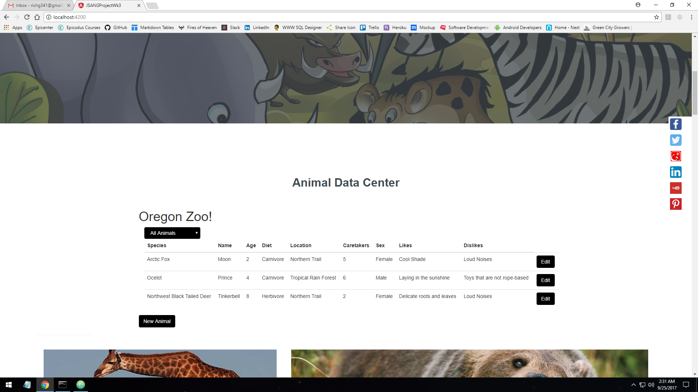

# Template file Readme
This web application will do the following:

* Application uses a model to organize data.
* Components create display and behavior for your templates.
* TypeScript is used throughout application; including variable data types.
* Users can successfully create and edit instances of a model.
* Models can be filtered using a pipe.
* Project is in a polished, portfolio-quality state. (Clear code presentation, error free, basic styling, complete README, thoughtful UI, etc.)
* README contains details on functionality you'd include in the future, given the opportunity.
* Required functionality was in place by the Friday deadline.
* Project demonstrates understanding of week's concepts. If prompted, you are able to discuss your code with an instructor using correct terminology.

## Setup/Installation Requirements

* Clone the repo
* navigate to  project root folder
* run in terminal $ npm install
* run in terminal $ bower install
* run in terminal $ gulp build
* Launch Index.html

## Specifications

| Behavior      | Example Input         | Example Output        |
| ------------- | ------------- | ------------- |
| user submits form to log new animal | animal details | Species, name, age, diet, location, caretakers, sex, likes, dislikes |
| view list of animals | button click | list of all animals |
| view animals by filter | young animals, mature animals | animals under 2, animals over 2 |
| edit animal | updated info | new info for animal |

## Known Bugs
* Contact Rich Garrick at <richg341@gmail.com>

## Contributing

1. Fork it!
2. Create your feature branch: `git checkout -b my-new-feature`
3. Commit your changes: `git commit -am 'Add some feature'`
4. Push to the branch: `git push origin my-new-feature`
5. Submit a pull request :D

## Future Features

* Extend the functionality of the app by building out the animal model to further enhance the app.
* Add custom SASS styling with corresponding Gulp tasks to compile.
* Display of the total number of caretakers needed in a day.
* Add a property that records when each animal was admitted. The user could enter a date and time, or the app can generate a timestamp.
* Expand the application to differentiate between animals' species. Group the animals into those categories. Then include a component to display the total needed caretakers for whichever species the user selects.
* Add a new master component to average the total age for each species.
* Show animals based on diet type. Then, show all animals who eat meat (carnivores AND omnivores)

## License
The MIT License (MIT)
Copyright 2017 Rich Garrick

Permission is hereby granted, free of charge, to any person obtaining a copy of this software and associated documentation files (the "Software"), to deal in the Software without restriction, including without limitation the rights to use, copy, modify, merge, publish, distribute, sublicense, and/or sell copies of the Software, and to permit persons to whom the Software is furnished to do so, subject to the following conditions:

The above copyright notice and this permission notice shall be included in all copies or substantial portions of the Software.

THE SOFTWARE IS PROVIDED "AS IS", WITHOUT WARRANTY OF ANY KIND, EXPRESS OR IMPLIED, INCLUDING BUT NOT LIMITED TO THE WARRANTIES OF MERCHANTABILITY, FITNESS FOR A PARTICULAR PURPOSE AND NONINFRINGEMENT. IN NO EVENT SHALL THE AUTHORS OR COPYRIGHT HOLDERS BE LIABLE FOR ANY CLAIM, DAMAGES OR OTHER LIABILITY, WHETHER IN AN ACTION OF CONTRACT, TORT OR OTHERWISE, ARISING FROM, OUT OF OR IN CONNECTION WITH THE SOFTWARE OR THE USE OR OTHER DEALINGS IN THE SOFTWARE.
